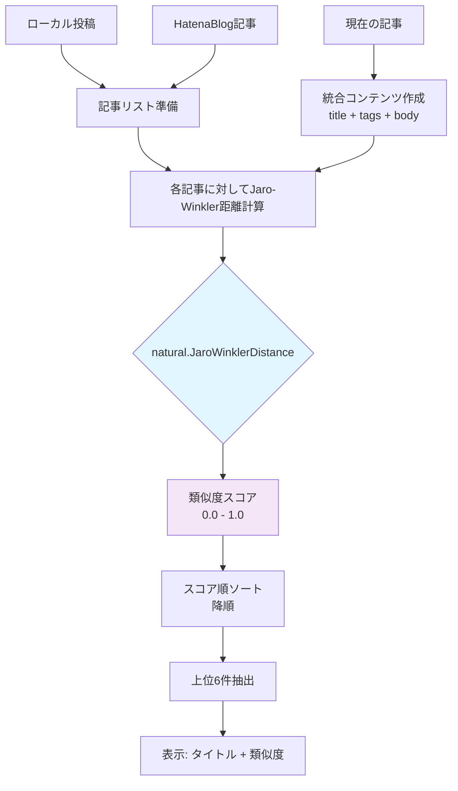
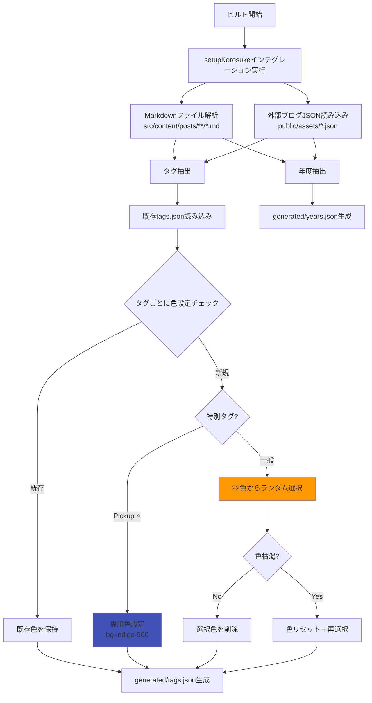
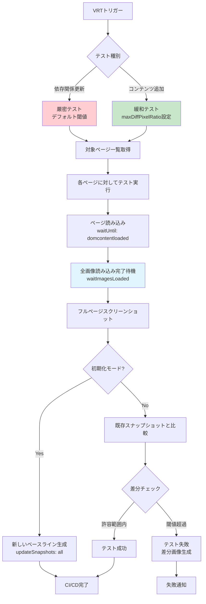
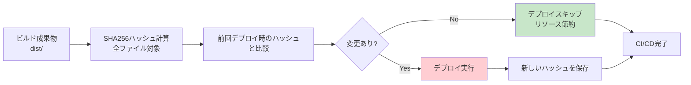

## はじめに

このブログサイト（korosuke613/homepage-2nd）の技術スタックの中でも、特に特筆すべき技術的実装について解説します。インタラクティブなアバター機能、類似記事推薦システム、独自ビルドシステム、ビジュアルリグレッションテストなど、一般的なサイトとは異なる独自の工夫を中心に紹介します。

## 特筆すべき技術実装

### 1. インタラクティブアバター「MyIcon」

サイトトップに配置されたアバター画像は、単なる装飾ではなく高度にインタラクティブなコンポーネントです。

**ソースコード**: [`src/components/MyIcon/index.tsx`](https://github.com/korosuke613/homepage-2nd/blob/main/src/components/MyIcon/index.tsx)  
**仕様書**: [`src/components/MyIcon/SPEC.md`](https://github.com/korosuke613/homepage-2nd/blob/main/src/components/MyIcon/SPEC.md)

#### 隠しキーボードコマンド機能

以下のコマンドをキーボードで入力することで、様々なモードを発動できます：

- **`mugen`**: No Limit Mode - 回転制限解除
- **`eien`**: Infinity Mode - 自動回転開始  
- **`clockup`**: 速度とインターバル加速
- **`kakku`**: DVD Mode - 跳ね返り移動
- **`oikake`**: Chase Mode - マウス追跡/回避

#### Chase Modeアルゴリズム

マウス追跡システムの動作フロー：

```mermaid
graph TD
    A[キーボード入力 'oikake'] --> B{現在のモード}
    B -->|none| C[Follow Mode]
    B -->|follow| D[Avoid Mode]  
    B -->|avoid| E[Chase Mode OFF]
    
    C --> F[マウス位置取得]
    D --> F
    F --> G[距離計算: √((mx-ix)² + (my-iy)²)]
    G --> H{距離 > 50px?}
    
    H -->|Yes| I{Follow Mode?}
    H -->|No| J{Follow Mode?}
    
    I -->|Yes| K[正規化ベクトル * 速度<br/>→ マウスに向かって移動]
    I -->|No| L[正規化ベクトル * -速度<br/>→ マウスから逃避]
    
    J -->|Yes| M[減速して停止]
    J -->|No| N[ランダム方向に逃避]
    
    K --> O[壁衝突判定]
    L --> O
    M --> O
    N --> O
    O --> P[次フレーム]
    P --> F
```

- **Follow**: マウスに向かって移動、近距離で減速停止
- **Avoid**: マウスから逃避、重複時はランダム方向
- **相互排他制御**: DVD ModeとChase Modeの自動切り替え

#### 技術的特徴

- **7種類の3D回転アニメーション**: Web Animations APIによる滑らかな回転
- **DVD Mode**: 画面端での跳ね返り動作＋13種類ビビッドカラー変更
- **60fpsアニメーション**: `requestAnimationFrame`による最適化
- **壁衝突検出**: [`handleCollision`関数](https://github.com/korosuke613/homepage-2nd/blob/main/src/components/MyIcon/index.tsx#L93-L118)による物理演算

### 2. 類似記事推薦システム

記事下部に表示される「あわせて読む」は、自然言語処理による類似度計算システムです。

**ソースコード**: [`src/utils/TextSimilarity.ts`](https://github.com/korosuke613/homepage-2nd/blob/main/src/utils/TextSimilarity.ts)  
**コンポーネント**: [`src/components/SimilarityPosts/index.tsx`](https://github.com/korosuke613/homepage-2nd/blob/main/src/components/SimilarityPosts/index.tsx)

#### Jaro-Winkler距離アルゴリズムによる類似度計算



#### 技術的特徴

- **マルチソース対応**: ローカルMarkdown投稿とHatenaBlog記事を統合分析
- **自然言語処理**: [`natural.js`](https://github.com/NaturalNode/natural)のJaro-Winkler距離アルゴリズムを使用
- **類似度可視化**: 計算結果のスコア（0.00-1.00）を併せて表示
- **外部リンク区別**: 内部記事と外部ブログの視覚的区別

### 3. 独自ビルドシステム「setupKorosukeインテグレーション」

Astroの`astro:config:setup`フックを活用した、カスタムビルド時処理システムです。

**ソースコード**: [`src/utils/Integration.mjs`](https://github.com/korosuke613/homepage-2nd/blob/main/src/utils/Integration.mjs)  
**設定**: [`astro.config.mjs`](https://github.com/korosuke613/homepage-2nd/blob/main/astro.config.mjs#L52)

#### 動的タグ色生成アルゴリズム



#### 技術的特徴

- **ビルド時実行**: Astroの`astro:config:setup`フックで自動実行
- **状態保持**: 既存のタグ色設定を保持しつつ新規タグにのみ色割り当て
- **枯渇対策**: 22色Tailwindカラー使い切った場合の再利用ロジック
- **特別扱い**: "Pickup ⭐️"タグの専用スタイル（`bg-indigo-900`）設定
- **マルチソース統合**: ローカルMarkdownと外部ブログの統合データ生成

### 4. 高度なビジュアルリグレッションテスト（VRT）

Playwrightを活用した、2段階の閾値設定による柔軟なVRTシステムです。

**ソースコード**: [`src/tests/vrt/`](https://github.com/korosuke613/homepage-2nd/tree/main/src/tests/vrt)  
**設定**: [`playwright-vrt.config.ts`](https://github.com/korosuke613/homepage-2nd/blob/main/playwright-vrt.config.ts)

#### VRTワークフロー



#### 技術的特徴

- **2段階閾値**: 依存関係更新時（厳密）とコンテンツ追加時（緩和）で異なる許容度
- **画像同期**: [`waitImagesLoaded`関数](https://github.com/korosuke613/homepage-2nd/blob/main/src/tests/vrt/utils.ts#L5-L16)による非同期画像読み込みの完全同期
- **CI/CD統合**: GitHub Actionsでの自動実行とスナップショット初期化
- **フルページ**: 縦スクロール全体のスクリーンショット比較

### 5. CI/CDでの特殊な最適化

**ワークフロー**: [`.github/workflows/`](https://github.com/korosuke613/homepage-2nd/tree/main/.github/workflows)

#### アーティファクト変更検出システム



#### 技術的特徴

- **デプロイ最適化**: [`ci.yaml`](https://github.com/korosuke613/homepage-2nd/blob/main/.github/workflows/ci.yaml#L89-L95)でビルド成果物の変更検出
- **VRT自動初期化**: mainブランチ更新時のスナップショット自動更新
- **リソース節約**: 変更がない場合のデプロイスキップによるGitHub Actions使用量削減

## まとめ

これらの特筆すべき技術実装により、単なる静的サイトを超えたインタラクティブで高品質な個人ホームページを実現しています：

### 技術的独自性
- **MyIcon**: 隠しコマンドによる多彩なインタラクション
- **類似記事推薦**: 自然言語処理による高精度なコンテンツマッチング
- **ビルドシステム**: 複数ソース統合とタグ色自動管理
- **VRT**: 用途別閾値設定による実用的な視覚回帰テスト

これらの実装は、個人サイトでありながら企業レベルの技術的複雑さと品質保証を実現し、訪問者に独特なユーザーエクスペリエンスを提供しています。