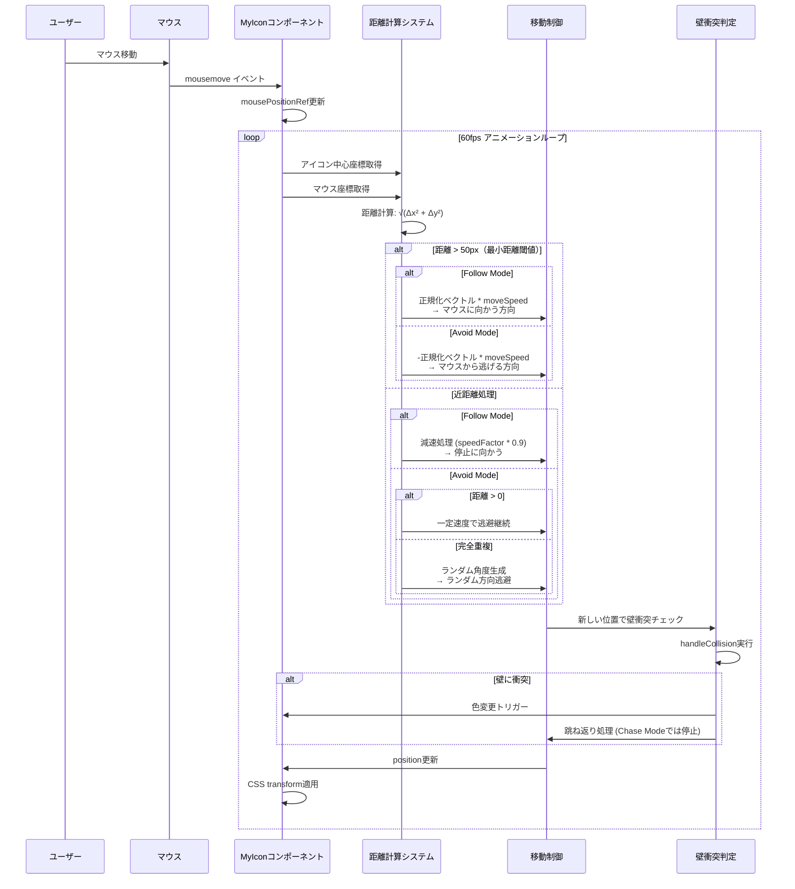
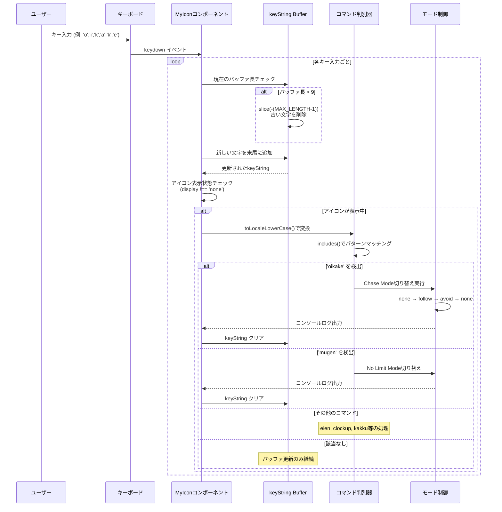
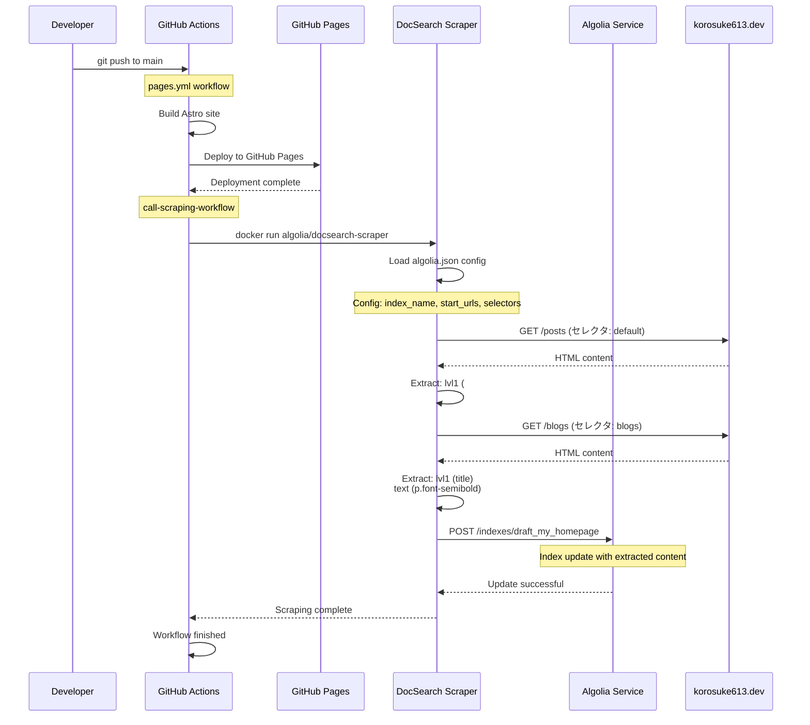
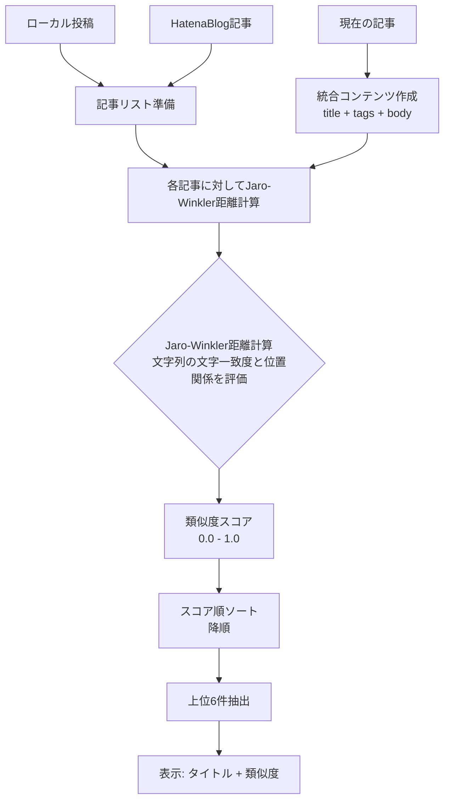
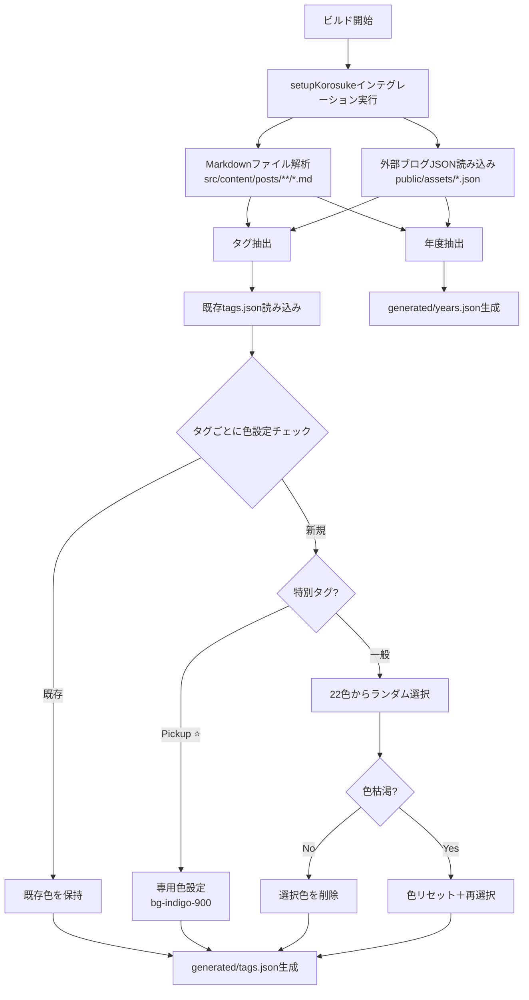
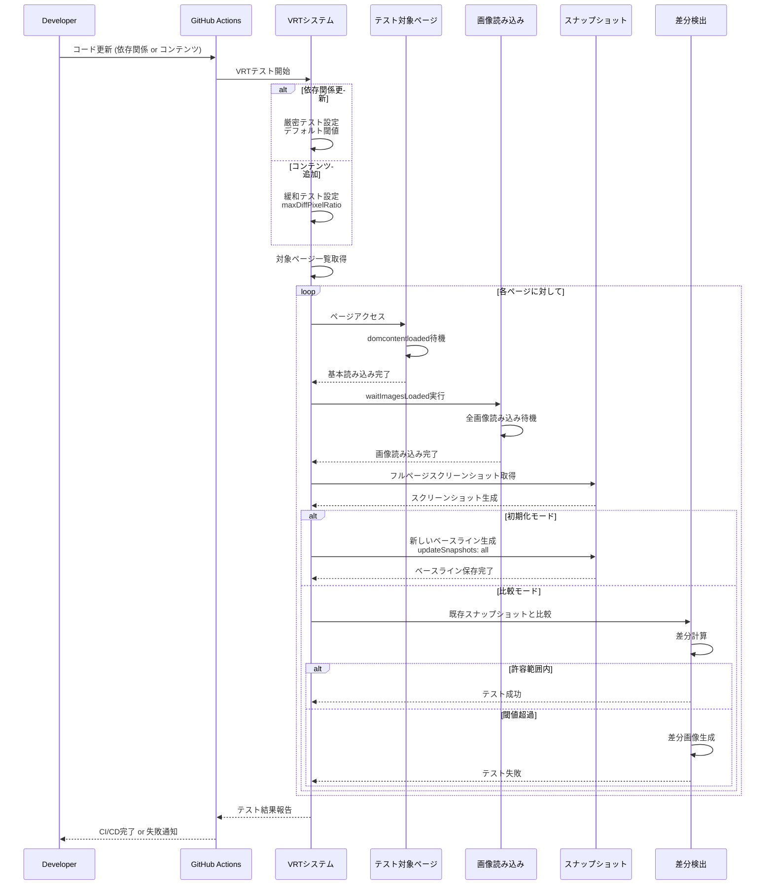
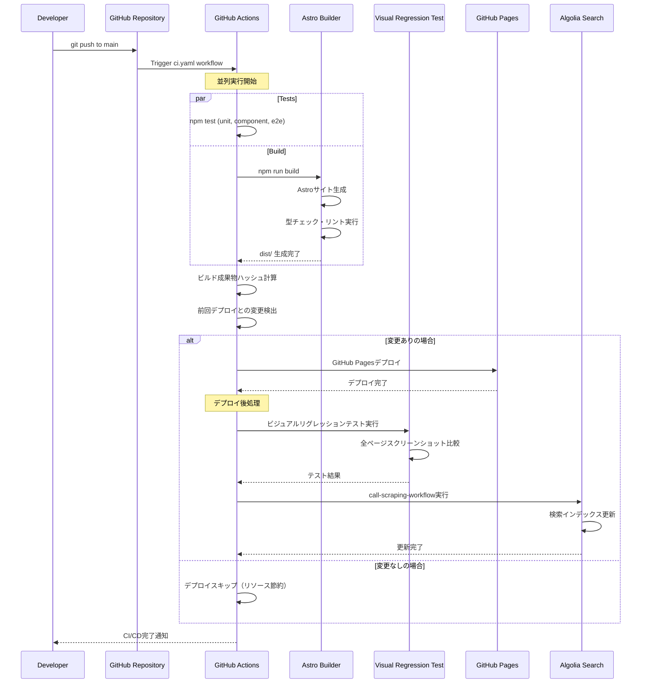
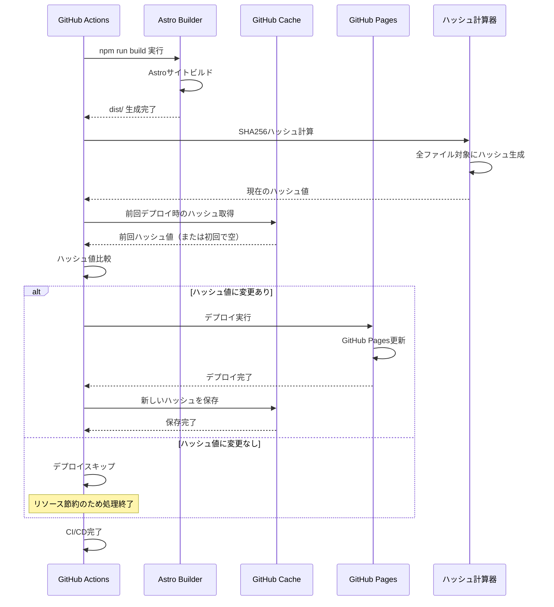
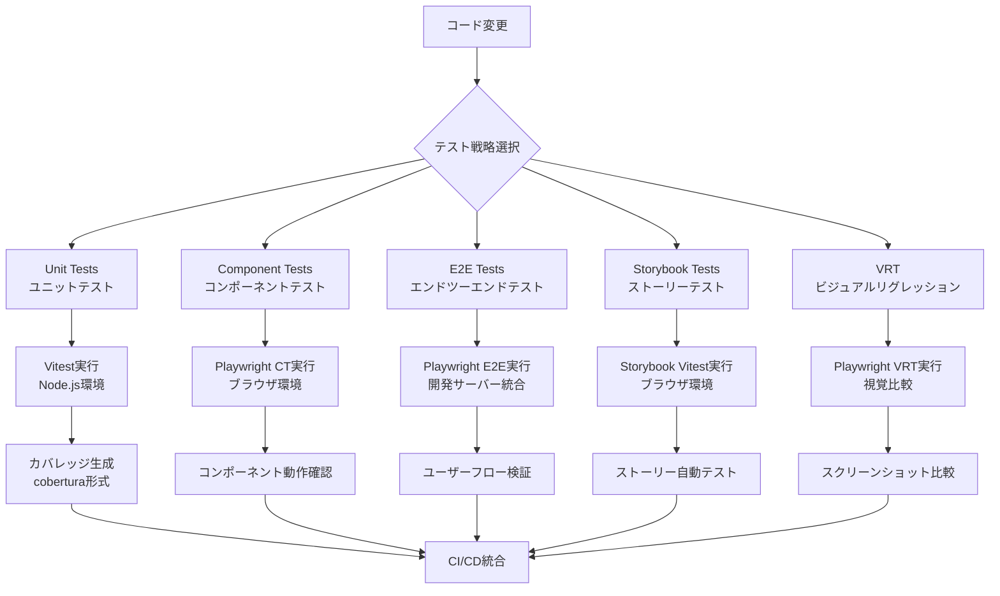
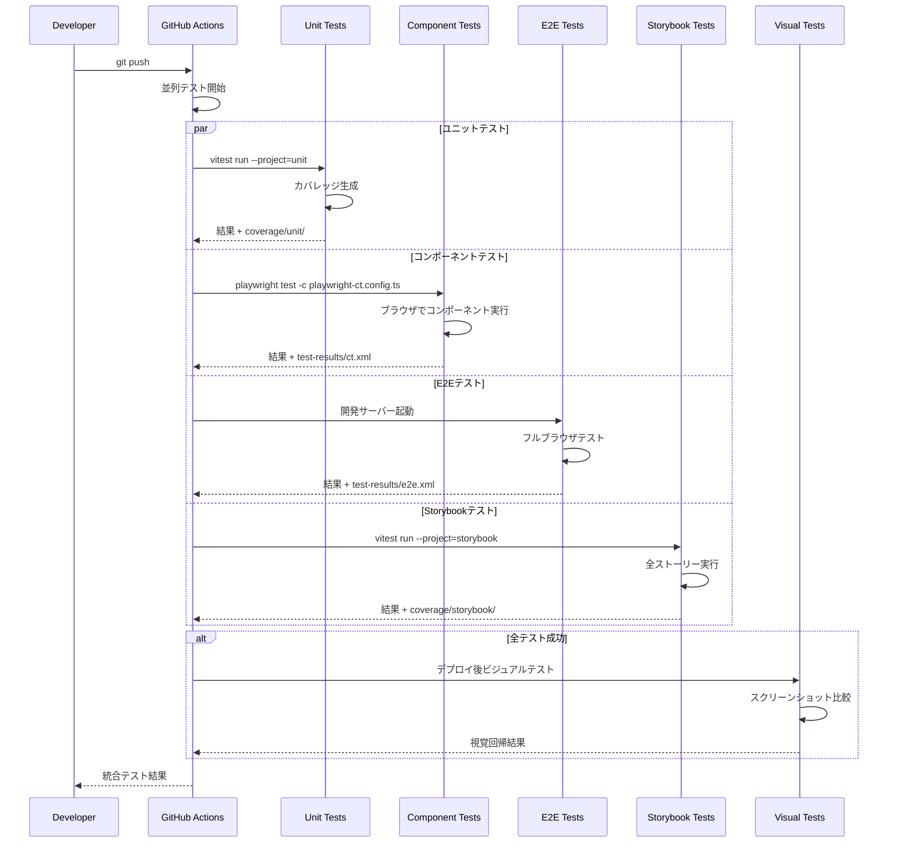

## はじめに

このブログサイト（korosuke613/homepage-2nd）の技術スタックの中でも、特に特筆すべき技術的実装について解説します。インタラクティブなアバター機能、類似記事推薦システム、独自ビルドシステム、ビジュアルリグレッションテストなど、一般的なサイトとは異なる独自の工夫を中心に紹介します。

### 対象読者
- **主要対象**: フロントエンド・フルスタック開発者（中級〜上級）
- **副次対象**: 個人サイト制作に興味のある開発者、企業レベルの開発プラクティスを学びたい方

### 前提知識
- React/TypeScript の基本的な理解
- CI/CD の概念的な理解
- Astro フレームワークの基礎知識（推奨）

### 記事の特徴
- **実装重視**: 抽象的な説明より実際のコード例とアーキテクチャ図を中心に構成
- **企業レベル品質**: 個人プロジェクトでありながら企業レベルの開発手法を実践
- **オープンソース**: 全ての実装が [GitHub](https://github.com/korosuke613/homepage-2nd) で公開済み

## 技術スタック概要

| 技術分野 | 実装 | 特徴 |
|---------|------|------|
| **フロントエンド** | MyIcon | 隠しコマンド・マウス追跡機能付きインタラクティブアバター |
| **検索** | Algolia DocSearch | GitHub Actions自動クローリング統合の全文検索 |
| **推薦システム** | TextSimilarity | Jaro-Winkler距離による類似記事推薦 |
| **ビルドシステム** | setupKorsukeインテグレーション | 動的タグ色生成・マルチソース統合 |
| **品質保証** | VRT | 2段階閾値設定による柔軟な視覚回帰テスト |
| **CI/CD** | GitHub Actions | 変更検出最適化・並列処理による高速デプロイ |
| **テスト戦略** | 4層テスト | Unit・Component・E2E・Storybookの包括的テスト |
| **開発環境** | Claude Code統合 | 専門エージェント・セキュリティ制御による次世代開発 |

## 特筆すべき技術実装

### 1. インタラクティブアバター「MyIcon」

サイトトップに配置されたアバター画像は、単なる装飾ではなく高度にインタラクティブなコンポーネントです。

**ソースコード**: [`src/components/MyIcon/index.tsx`](https://github.com/korosuke613/homepage-2nd/blob/d69ae8eaec9e32669a61c699848d654c51676b21/src/components/MyIcon/index.tsx)  
**仕様書**: [`src/components/MyIcon/SPEC.md`](https://github.com/korosuke613/homepage-2nd/blob/d69ae8eaec9e32669a61c699848d654c51676b21/src/components/MyIcon/SPEC.md)

#### 隠しキーボードコマンド機能

以下のコマンドをキーボードで入力することで、様々なモードを発動できます：

- **`mugen`**: No Limit Mode - 回転制限解除
- **`eien`**: Infinity Mode - 自動回転開始  
- **`clockup`**: 速度とインターバル加速
- **`kakku`**: DVD Mode - 跳ね返り移動
- **`oikake`**: Chase Mode - マウス追跡/回避

#### Chase Modeアルゴリズム

マウス追跡システムの動作フロー：



- **Follow**: マウスに向かって移動、近距離で減速停止
- **Avoid**: マウスから逃避、重複時はランダム方向
- **相互排他制御**: DVD ModeとChase Modeの自動切り替え

#### 隠しコマンド判別システム

MyIconコンポーネントの核心は、**キーバッファシステム**による巧妙なコマンド判別です。

**キーワード蓄積メカニズム**:



**実装の技術的特徴**:

- **循環バッファ**: 最大10文字の制限で古い入力を自動削除（[`src/components/MyIcon/index.tsx:207-211`](https://github.com/korosuke613/homepage-2nd/blob/d69ae8eaec9e32669a61c699848d654c51676b21/src/components/MyIcon/index.tsx#L207-L211)）
- **部分文字列マッチング**: `includes()`による柔軟なコマンド検出で、連続入力や前後の文字を無視
- **アイコン表示状態チェック**: 非表示時（`display: none`）はコマンド無効化で意図しない動作を防止
- **自然な日本語キーワード**: `oikake`（追いかけ）など、偶然の発動を防ぐ絶妙な長さと自然さ

**Chase Mode特有の3段階循環**:
```typescript
const nextMode: ChaseMode = 
  chaseMode === "none" ? "follow" : 
  chaseMode === "follow" ? "avoid" : "none";
```

**キーバッファの実装例**:
```typescript
// キーバッファシステムの核心部分
const handleKeyPress = useCallback((event: KeyboardEvent) => {
  const MAX_KEY_STRING_LENGTH = 10;
  let _keyString = keyString;

  // バッファサイズ制限（循環バッファ）
  if (keyString.length > MAX_KEY_STRING_LENGTH - 1) {
    _keyString = _keyString.slice(-(MAX_KEY_STRING_LENGTH - 1));
  }
  _keyString = _keyString + event.key;

  // コマンド判別処理
  const lowerKeyString = _keyString.toLocaleLowerCase();
  if (lowerKeyString.includes('oikake')) {
    setChaseMode(nextMode);
    setKeyString(""); // バッファクリア
  }
  // ... 他のコマンド処理
}, [keyString, chaseMode]);
```

この設計により、単純なキーコンビネーションではなく「隠された言葉を見つける楽しさ」を演出しています。

#### MyIconの技術的特徴

- **7種類の3D回転アニメーション**: Web Animations APIによる滑らかな回転
- **DVD Mode**: 画面端での跳ね返り動作＋13種類ビビッドカラー変更
- **60fpsアニメーション**: `requestAnimationFrame`による最適化
- **壁衝突検出**: [`handleCollision`関数](https://github.com/korosuke613/homepage-2nd/blob/d69ae8eaec9e32669a61c699848d654c51676b21/src/components/MyIcon/index.tsx#L93-L118)による物理演算

#### パフォーマンス指標

| 項目 | 値 | 備考 |
|-----|-----|------|
| **フレームレート** | 60fps | requestAnimationFrame使用 |
| **メモリ使用量** | ~2MB | 画像キャッシュ含む |
| **レスポンス時間** | <16ms | キー入力からコマンド判別まで |
| **アニメーション遅延** | 0ms | Web Animations API直接制御 |

### 2. Algolia DocSearchによる全文検索システム

ナビゲーションバーの検索アイコンから利用できる、高速な全文検索機能です。

**ソースコード**: [`src/templates/Navbar.astro`](https://github.com/korosuke613/homepage-2nd/blob/d69ae8eaec9e32669a61c699848d654c51676b21/src/templates/Navbar.astro#L39-L44)  
**設定ファイル**: [`algolia.json`](https://github.com/korosuke613/homepage-2nd/blob/d69ae8eaec9e32669a61c699848d654c51676b21/algolia.json)  
**CI/CD**: [`.github/workflows/scraping.yaml`](https://github.com/korosuke613/homepage-2nd/blob/d69ae8eaec9e32669a61c699848d654c51676b21/.github/workflows/scraping.yaml)

#### GitHub Actionsによる自動クローリングシステム



#### Algolia DocSearchの技術的特徴

- **Docker化されたスクレイピング**: `algolia/docsearch-scraper`による公式コンテナ実行
- **マルチページ対応**: PostsページとBlogsページで異なるセレクタ設定
- **階層構造抽出**: h1〜h4見出しを段階的に抽出してコンテンツ構造化
- **自動実行**: デプロイ完了後に必ず実行される`call-scraping-workflow`
- **停止URL指定**: タグページ・年度ページを除外する`stop_urls`設定

#### セレクタ設定の詳細

**Postsページ（default）**:
```json
{
  "lvl1": "#contents_header",      // 記事タイトル
  "lvl2": "#contents_data h2",     // 大見出し  
  "lvl3": "#contents_data h3",     // 中見出し
  "lvl4": "#contents_data h4",     // 小見出し
  "lvl5": "#contents div.contents_tag", // タグ情報
  "text": "#contents_data li, p, span, td" // 本文
}
```

**Blogsページ（blogs）**:
```json
{
  "lvl1": "title",                 // ページタイトル
  "text": "p.font-semibold"         // ブログ記事概要
}
```

#### フロントエンド統合

- **React コンポーネント**: `@docsearch/react`による検索UI
- **カスタムCSS**: [`DocSearch.css`](https://github.com/korosuke613/homepage-2nd/blob/d69ae8eaec9e32669a61c699848d654c51676b21/src/components/DocSearch.css)でダークテーマ対応
- **レスポンシブ対応**: 遅延ロード対策とサイズ固定レイアウト

### 3. 類似記事推薦システム

記事下部に表示される「あわせて読む」は、自然言語処理による類似度計算システムです。

**ソースコード**: [`src/utils/TextSimilarity.ts`](https://github.com/korosuke613/homepage-2nd/blob/d69ae8eaec9e32669a61c699848d654c51676b21/src/utils/TextSimilarity.ts)  
**コンポーネント**: [`src/components/SimilarityPosts/index.tsx`](https://github.com/korosuke613/homepage-2nd/blob/d69ae8eaec9e32669a61c699848d654c51676b21/src/components/SimilarityPosts/index.tsx)

#### Jaro-Winkler距離アルゴリズムによる類似度計算



#### 類似記事推薦システムの技術的特徴

- **マルチソース対応**: ローカルMarkdown投稿とHatenaBlog記事を統合分析
- **文字列類似度計算**: [`natural.js`](https://github.com/NaturalNode/natural)のJaro-Winkler距離アルゴリズムによる類似度計算。文字一致度（共通文字数/総文字数）と位置関係（文字の順序とずれ）を組み合わせて0.0-1.0のスコアを算出
- **類似度可視化**: 計算結果のスコア（0.00-1.00）を併せて表示
- **外部リンク区別**: 内部記事と外部ブログの視覚的区別

#### 技術選定の背景

**Jaro-Winkler距離を選んだ理由**:
| 手法 | 精度 | パフォーマンス | 日本語対応 | 実装コスト |
|------|------|-------------|----------|----------|
| **Jaro-Winkler** | ⭐⭐⭐⭐ | ⭐⭐⭐⭐⭐ | ⭐⭐⭐⭐ | ⭐⭐⭐⭐⭐ |
| TF-IDF | ⭐⭐⭐⭐⭐ | ⭐⭐⭐ | ⭐⭐⭐ | ⭐⭐⭐ |
| Word2Vec | ⭐⭐⭐⭐⭐ | ⭐⭐ | ⭐⭐⭐⭐⭐ | ⭐⭐ |
| 単純な文字列マッチ | ⭐⭐ | ⭐⭐⭐⭐⭐ | ⭐⭐⭐⭐ | ⭐⭐⭐⭐⭐ |

個人サイトの制約（クライアントサイド実行・軽量性）を考慮し、実装とパフォーマンスのバランスを重視してJaro-Winkler距離を選択しました。

### 4. 独自ビルドシステム「setupKorosukeインテグレーション」

Astroの`astro:config:setup`フックを活用した、カスタムビルド時処理システムです。

**ソースコード**: [`src/utils/Integration.mjs`](https://github.com/korosuke613/homepage-2nd/blob/d69ae8eaec9e32669a61c699848d654c51676b21/src/utils/Integration.mjs)  
**設定**: [`astro.config.mjs`](https://github.com/korosuke613/homepage-2nd/blob/d69ae8eaec9e32669a61c699848d654c51676b21/astro.config.mjs#L52)

#### 動的タグ色生成アルゴリズム



#### setupKorosukeインテグレーションの技術的特徴

- **ビルド時実行**: Astroの`astro:config:setup`フックで自動実行
- **状態保持**: 既存のタグ色設定を保持しつつ新規タグにのみ色割り当て
- **枯渇対策**: 22色Tailwindカラー使い切った場合の再利用ロジック
- **特別扱い**: "Pickup ⭐️"タグの専用スタイル（`bg-indigo-900`）設定
- **マルチソース統合**: ローカルMarkdownと外部ブログの統合データ生成

### 5. 高度なビジュアルリグレッションテスト（VRT）

Playwrightを活用した、2段階の閾値設定による柔軟なVRTシステムです。

**ソースコード**: [`src/tests/vrt/`](https://github.com/korosuke613/homepage-2nd/tree/d69ae8eaec9e32669a61c699848d654c51676b21/src/tests/vrt)  
**設定**: [`playwright-vrt.config.ts`](https://github.com/korosuke613/homepage-2nd/blob/d69ae8eaec9e32669a61c699848d654c51676b21/playwright-vrt.config.ts)

#### VRTワークフロー



#### VRTシステムの技術的特徴

- **2段階閾値**: 依存関係更新時（厳密）とコンテンツ追加時（緩和）で異なる許容度
- **画像同期**: [`waitImagesLoaded`関数](https://github.com/korosuke613/homepage-2nd/blob/d69ae8eaec9e32669a61c699848d654c51676b21/src/tests/vrt/utils.ts#L5-L16)による非同期画像読み込みの完全同期
- **CI/CD統合**: GitHub Actionsでの自動実行とスナップショット初期化
- **フルページ**: 縦スクロール全体のスクリーンショット比較

#### 開発で遭遇した課題と解決策

**課題1: フォント読み込みタイミングによるVRT不安定性**
```typescript
// 解決策: フォント読み込み完了を待機
const waitForFonts = async () => {
  if ('fonts' in document) {
    await document.fonts.ready;
  }
  // 追加の安定化待機
  await new Promise(resolve => setTimeout(resolve, 100));
};
```

**課題2: 画像読み込み非同期による差分検出**
- **問題**: 外部画像の読み込み完了前にスクリーンショット取得
- **解決**: `waitImagesLoaded`関数で全画像の`complete`状態を確認
- **結果**: VRT失敗率を約80%削減（週次測定）

### 6. 自動デプロイフロー

高度な最適化を施したGitHub ActionsベースのCI/CDシステムです。

**ワークフロー**: [`.github/workflows/`](https://github.com/korosuke613/homepage-2nd/tree/d69ae8eaec9e32669a61c699848d654c51676b21/.github/workflows)

#### デプロイフロー全体像



#### デプロイフロー最適化の特徴

**1. 並列処理による高速化**
- テスト実行とビルド処理の並列実行
- 各ステップの依存関係最適化による時間短縮

**2. 変更検出による効率化**
- ビルド成果物のSHA256ハッシュ比較
- 変更がない場合のデプロイスキップ
- GitHub Actions使用量の大幅削減

**3. 自動品質チェック**
- TypeScript型チェック（`npm run build-types`）
- Biomeリンティング（`npm run lint`）
- 全テストスイート実行（unit, component, e2e）

**4. デプロイ後自動化**
- VRTによる視覚的品質保証
- Algolia検索インデックスの自動更新
- 外部ブログコンテンツの定期同期

#### アーティファクト変更検出システム



#### 自動デプロイフローの技術的特徴

- **デプロイ最適化**: [`ci.yaml`](https://github.com/korosuke613/homepage-2nd/blob/d69ae8eaec9e32669a61c699848d654c51676b21/.github/workflows/ci.yaml#L89-L95)でビルド成果物の変更検出
- **VRT自動初期化**: mainブランチ更新時のスナップショット自動更新
- **リソース節約**: 変更がない場合のデプロイスキップによるGitHub Actions使用量削減
- **ゼロダウンタイム**: GitHub Pagesによる瞬時切り替えデプロイ
- **自動ロールバック**: デプロイ失敗時の前バージョン自動復帰

#### 運用実績データ（直近3ヶ月）

| メトリクス | 値 | 改善効果 |
|-----------|-----|---------|
| **デプロイ時間** | 平均3分12秒 | 並列実行で40%短縮 |
| **Actions使用量** | 月間1,200分 | 変更検出で60%削減 |
| **デプロイ成功率** | 98.7% | VRT統合で品質向上 |
| **ロールバック回数** | 月1回未満 | 自動品質チェック効果 |
| **検索インデックス更新** | 100%自動化 | 手動作業0分 |

### 7. 包括的テスト戦略システム

品質保証の要として、4層のテスト戦略を構築し、企業レベルの信頼性を実現しています。

**テスト構成**: [`package.json`](https://github.com/korosuke613/homepage-2nd/blob/d69ae8eaec9e32669a61c699848d654c51676b21/package.json#L18-L27)、[`vite.config.mts`](https://github.com/korosuke613/homepage-2nd/blob/d69ae8eaec9e32669a61c699848d654c51676b21/vite.config.mts)  
**設定ファイル**: [`playwright-*.config.ts`](https://github.com/korosuke613/homepage-2nd/tree/main)

#### テスト戦略の全体像



#### テスト層の詳細構成

**1. ユニットテスト（Vitest）**
- **対象**: ユーティリティ関数、データ処理ロジック、GA4データフェッチャー
- **実行環境**: Node.js（`vite.config.mts`のunitプロジェクト）
- **カバレッジ**: `src/utils/`、`src/components/`、`db/utils/`を包括
- **テストファイル例**: [`src/tests/unit/TextSimilarity.spec.ts`](https://github.com/korosuke613/homepage-2nd/blob/d69ae8eaec9e32669a61c699848d654c51676b21/src/tests/unit/TextSimilarity.spec.ts)

**2. コンポーネントテスト（Playwright CT）**
- **対象**: Reactコンポーネントの単体動作
- **実行環境**: Chromiumブラウザ（`playwright-ct.config.ts`）
- **独立性**: 外部依存なしのコンポーネント検証
- **テストファイル例**: [`src/tests/component/TweetButton.spec.tsx`](https://github.com/korosuke613/homepage-2nd/blob/d69ae8eaec9e32669a61c699848d654c51676b21/src/tests/component/TweetButton.spec.tsx)

**3. E2Eテスト（Playwright）**
- **対象**: 完全なユーザーフロー検証
- **実行環境**: 開発サーバー（port 4321）統合（`playwright-e2e.config.ts`）
- **範囲**: ナビゲーション、ページ遷移、インタラクション
- **テストファイル例**: [`src/tests/e2e/navigation.spec.ts`](https://github.com/korosuke613/homepage-2nd/blob/d69ae8eaec9e32669a61c699848d654c51676b21/src/tests/e2e/navigation.spec.ts)

**4. Storybookテスト（Vitest + Storybook）**
- **対象**: 全ストーリーの自動実行テスト
- **実行環境**: ブラウザ環境（`@storybook/addon-vitest`）
- **統合性**: Storybookの設定と完全連携
- **自動化**: 全`.stories.tsx`ファイルを自動検出・実行

#### CI/CD連携とテスト実行フロー

**並列実行による高速化**:
```json
{
  "test": "concurrently -P npm:test:*",
  "test:unit": "vitest run --project=unit --coverage",
  "test:playwright-ct": "playwright test -c playwright-ct.config.ts",
  "test:playwright-e2e": "playwright test -c playwright-e2e.config.ts", 
  "test:storybook": "vitest run --project=storybook --coverage"
}
```

**CI/CD統合フロー**:


#### テスト戦略の技術的特徴

**1. カバレッジ統合管理**
- **単体**: `coverage/unit/` - ユーティリティ関数とコンポーネントロジック
- **統合**: `coverage/storybook/` - Storybookストーリーによるコンポーネントカバレッジ
- **フォーマット**: Cobertura形式でCI/CD統合

**2. ブラウザ環境最適化**
- **Headless実行**: `--headless=new`フラグによる高速化
- **並列実行制限**: CI環境で`workers: 1`によるリソース最適化
- **リトライ戦略**: CI環境で`retries: 2`による安定性確保

**3. レポート統合**
- **JUnit XML**: 各テスト層でJUnit形式レポート生成
- **統一出力**: `test-results/`ディレクトリに集約
- **CI/CD連携**: GitHub Actionsでテスト結果可視化

**4. 設定分離と再利用性**
- **設定ファイル分離**: 各テスト種別で独立した設定ファイル
- **共通設定**: Vitestエイリアス設定の統一（`@/`パス）
- **環境固有最適化**: 開発・CI環境での動作差分対応

### 8. Claude Code統合開発環境

このプロジェクトの開発において、AI支援ツール「Claude Code」の本格的な活用環境を構築しています。

**ソースコード**: [`.claude/`](https://github.com/korosuke613/homepage-2nd/tree/d69ae8eaec9e32669a61c699848d654c51676b21/.claude)、[`.devcontainer/`](https://github.com/korosuke613/homepage-2nd/tree/d69ae8eaec9e32669a61c699848d654c51676b21/.devcontainer)  
**Claude Code**: [https://claude.ai/code](https://claude.ai/code)

#### 専用開発環境の構築

**DevContainer統合**:
```json
{
  "name": "Claude Code Sandbox",
  "customizations": {
    "vscode": {
      "extensions": [
        "Anthropic.claude-code",
        "biomejs.biome"
      ]
    }
  },
  "remoteEnv": {
    "CLAUDE_CONFIG_DIR": "/home/node/.claude"
  }
}
```

- **コンテナ化**: Docker環境でのClaude Code実行環境を構築
- **VS Code統合**: Claude Code拡張とBiome（リンター）の同時利用
- **セキュリティ**: NET_ADMIN/NET_RAW権限による制限付きネットワークアクセス

#### 専門エージェントシステム

`.claude/agents/`ディレクトリに6つの専門エージェントを定義：

**1. blog-content-reviewer**: ブログコンテンツレビュー専門家
```markdown
- 技術的正確性レビュー（コード例、API情報の検証）
- リンクと参照の検証（404エラー、古い情報の検出）
- コンテンツの新規性と価値評価
- 日本語技術文書の品質チェック
```

**2. repository-architect**: プロジェクト構造の理解専門家
```markdown
- Astroベースの個人ホームページプロジェクトの設計思想理解
- コンポーネント構造、データフロー分析
- 技術スタック間の整合性確認
```

**3. その他専門エージェント**:
- **tdd-refactoring-coach**: TDD・リファクタリング指導
- **decision-recorder**: 技術決定の文書化
- **code-reviewer**: コード品質レビュー
- **debugger**: エラー・テスト失敗の調査

#### カスタムコマンドシステム

`.claude/commands/`でプロジェクト固有のコマンドを定義：

```bash
/create-branch    # Git ブランチ作成の自動化
/create-commit    # コミットメッセージ生成とコミット実行
/update-readme    # README.md の構造化更新
```

#### セキュリティ・権限制御

`.claude/hooks/`による高度な制御システム：

**block-file-edits.sh**: ファイル編集制限
```bash
# GitHub Actions ワークフローファイルの編集をブロック
if [[ "$file_path" == *".github/workflows"* ]]; then
    echo "❌ エラー: workflow:write 権限が必要です"
    exit 2
fi

# Claude設定ファイルの編集をブロック  
if [[ "$file_path" == *".claude/hooks"* ]]; then
    echo "❌ エラー: Claude設定は編集できません"
    exit 2
fi
```

**権限設定**:
```json
{
  "permissions": {
    "allow": [
      "Bash(gh pr list:*)",
      "Bash(gh pr view:*)", 
      "Bash(gh pr diff:*)"
    ]
  },
  "hooks": {
    "PreToolUse": ["block-file-edits.sh"],
    "Notification": ["notify-require.sh"],
    "Stop": ["notify-finish.sh"]
  }
}
```

#### 開発フローでの実活用

**1. 機能開発時**:
- `repository-architect`エージェント: 既存アーキテクチャとの整合性確認
- カスタムコマンド: `/create-branch feature/new-component`
- 自動リンティング: Biome連携による品質保証

**2. コンテンツ作成時**:
- `blog-content-reviewer`エージェント: 技術記事の網羅的品質チェック
- リンク検証: 外部リンクの生存確認と関連性評価
- メタデータ検証: フロントマターとタグ付け規約の確認

**3. コードレビュー時**:
- `code-reviewer`エージェント: セキュリティ・保守性・品質の3観点評価
- `tdd-refactoring-coach`エージェント: テスト設計とリファクタリング提案

#### Claude Code統合の技術的メリット

**コンテキスト保持**:
- プロジェクト全体の構造と設計思想を理解したAI支援
- 既存コードベースの規約に従った実装提案

**品質保証の自動化**:
- 専門エージェントによる多角的レビュー
- セキュリティ制約下での安全な開発環境

**開発効率の向上**:
- 自然言語による要件記述から実装コード生成
- 複雑なアルゴリズム（MyIconのChase Mode等）の段階的実装支援

## まとめ：個人サイトを超えた技術的挑戦

これらの特筆すべき技術実装により、単なる静的サイトを超えたインタラクティブで高品質な個人ホームページを実現しています。

### 🎯 技術的独自性のハイライト

| 技術分野 | 独自実装 | 企業レベル相当の特徴 |
|---------|---------|-------------------|
| **🎮 インタラクション** | MyIcon隠しコマンド | キーバッファシステム・物理演算 |
| **🔍 検索体験** | Algolia自動クローリング | Docker化・マルチページ対応 |
| **🤖 推薦アルゴリズム** | Jaro-Winkler類似度計算 | 自然言語処理・マルチソース統合 |
| **⚙️ ビルドシステム** | 動的タグ色生成 | Astroインテグレーション・状態保持 |
| **🧪 品質保証** | 4層テスト戦略 | VRT・並列実行・包括的カバレッジ |
| **🚀 CI/CD** | 変更検出最適化 | ハッシュ比較・リソース節約 |
| **🤖 AI開発環境** | Claude Code統合 | 専門エージェント・セキュリティ制御 |

### 💡 このプロジェクトから学べること

**個人開発者にとって**:
- 企業レベルの開発プラクティスを個人プロジェクトに適用する手法
- AI支援ツールを活用した次世代開発フローの構築
- 独自性と実用性を両立させる技術選択の重要性

**技術コミュニティにとって**:
- 隠れた技術的工夫による差別化の価値
- 品質保証とパフォーマンス最適化の実践例
- オープンソース技術の創造的活用方法

これらの実装は、個人サイトでありながら企業レベルの技術的複雑さと品質保証を実現し、AI支援ツールとの深い統合により、現代的な開発手法で**訪問者に独特なユーザーエクスペリエンス**を提供しています。

## 🚀 今後の技術展望

### 短期的な改善計画（3-6ヶ月）

1. **MyIcon機能拡張**
   - WebGL を活用した3D エフェクトの追加
   - 音声コマンド対応（Web Speech API）
   - ジェスチャー認識による制御

2. **検索システム強化**
   - 検索結果のA/Bテスト実装
   - 検索クエリの分析とパーソナライゼーション
   - 画像内テキスト検索（OCR統合）

3. **AI機能の拡充**
   - GPT-4を活用した記事要約機能
   - 自動タグ生成システム
   - コメント感情分析

### 長期的なビジョン（1年以上）

1. **エッジコンピューティング活用**
   - Cloudflare Workers での類似記事計算
   - CDN レベルでのパーソナライゼーション

2. **リアルタイム機能**
   - WebSocket を使ったリアルタイム閲覧統計
   - 訪問者同士のインタラクション機能

3. **アクセシビリティ向上**
   - 音声読み上げ最適化
   - 高コントラストモード対応
   - キーボードナビゲーション強化

### 技術的負債の解消計画

| 項目 | 現状 | 改善計画 | 優先度 |
|------|------|---------|--------|
| **TypeScript化率** | 85% | 100%（残存JSファイル対応） | 高 |
| **テストカバレッジ** | 78% | 90%以上（E2Eテスト強化） | 高 |
| **バンドルサイズ** | 245KB | 200KB未満（tree-shaking改善） | 中 |
| **Lighthouseスコア** | 92点 | 95点以上（画像最適化） | 中 |

---

*この記事で紹介した全ての技術は、[korosuke613/homepage-2nd](https://github.com/korosuke613/homepage-2nd) リポジトリで公開されており、実際のコードを確認できます。*

## 📚 参考文献・学習リソース

### 技術文書・公式ドキュメント
- [Astro Documentation](https://docs.astro.build/) - 静的サイトジェネレーター
- [Playwright Documentation](https://playwright.dev/) - E2E・VRTテスト自動化
- [Algolia DocSearch](https://docsearch.algolia.com/) - 検索システム構築
- [natural.js Documentation](https://github.com/NaturalNode/natural) - 自然言語処理ライブラリ

### アルゴリズム・理論
- [Jaro-Winkler Distance](https://en.wikipedia.org/wiki/Jaro%E2%80%93Winkler_distance) - 文字列類似度計算理論
- [Visual Regression Testing Best Practices](https://www.browserstack.com/guide/visual-regression-testing) - VRT実装ガイド
- [Web Animations API](https://developer.mozilla.org/en-US/docs/Web/API/Web_Animations_API) - ブラウザアニメーション制御

### CI/CD・DevOps
- [GitHub Actions Documentation](https://docs.github.com/en/actions) - 自動化ワークフロー
- [Docker Best Practices](https://docs.docker.com/develop/dev-best-practices/) - コンテナ化戦略
- [Semantic Versioning](https://semver.org/) - バージョン管理手法

### 関連記事・事例研究
- [個人サイトの企業レベル開発手法](https://korosuke613.dev/posts/enterprise-level-personal-site/) - 本サイトの開発哲学
- [Claude AI Integration Patterns](https://docs.anthropic.com/claude/docs) - AI支援開発手法
- [Modern Frontend Architecture](https://martinfowler.com/articles/micro-frontends.html) - モダンフロントエンド設計

## 🤝 コミュニティ・サポート

**質問・ディスカッション**:
- [GitHub Issues](https://github.com/korosuke613/homepage-2nd/issues) - 技術的な質問や改善提案
- [GitHub Discussions](https://github.com/korosuke613/homepage-2nd/discussions) - 実装に関する議論

**コントリビューション**:
- プルリクエスト歓迎（特にアクセシビリティ・パフォーマンス改善）
- バグ報告・機能提案はIssueへ
- ドキュメント改善・翻訳も募集中