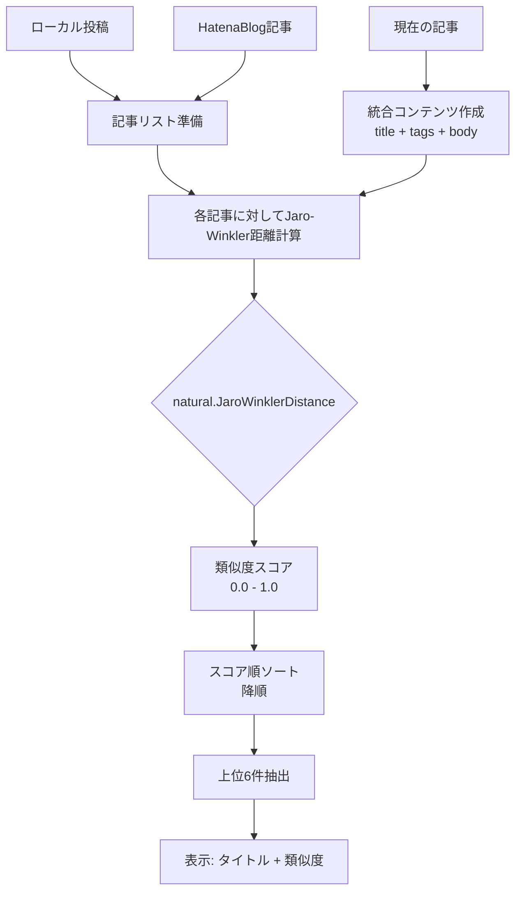

## はじめに

このブログサイト（korosuke613/homepage-2nd）の技術スタックの中でも、特に特筆すべき技術的実装について解説します。インタラクティブなアバター機能、類似記事推薦システム、独自ビルドシステム、ビジュアルリグレッションテストなど、一般的なサイトとは異なる独自の工夫を中心に紹介します。

## 特筆すべき技術実装

### 1. インタラクティブアバター「MyIcon」

サイトトップに配置されたアバター画像は、単なる装飾ではなく高度にインタラクティブなコンポーネントです。

**ソースコード**: [`src/components/MyIcon/index.tsx`](https://github.com/korosuke613/homepage-2nd/blob/main/src/components/MyIcon/index.tsx)  
**仕様書**: [`src/components/MyIcon/SPEC.md`](https://github.com/korosuke613/homepage-2nd/blob/main/src/components/MyIcon/SPEC.md)

#### 隠しキーボードコマンド機能

以下のコマンドをキーボードで入力することで、様々なモードを発動できます：

- **`mugen`**: No Limit Mode - 回転制限解除
- **`eien`**: Infinity Mode - 自動回転開始  
- **`clockup`**: 速度とインターバル加速
- **`kakku`**: DVD Mode - 跳ね返り移動
- **`oikake`**: Chase Mode - マウス追跡/回避

#### Chase Modeアルゴリズム

マウス追跡システムの動作フロー：


- **Follow**: マウスに向かって移動、近距離で減速停止
- **Avoid**: マウスから逃避、重複時はランダム方向
- **相互排他制御**: DVD ModeとChase Modeの自動切り替え

#### 隠しコマンド判別システム

MyIconコンポーネントの核心は、**キーバッファシステム**による巧妙なコマンド判別です。

**キーワード蓄積メカニズム**:


**実装の技術的特徴**:

- **循環バッファ**: 最大10文字の制限で古い入力を自動削除（[`src/components/MyIcon/index.tsx:207-211`](https://github.com/korosuke613/homepage-2nd/blob/main/src/components/MyIcon/index.tsx#L207-L211)）
- **部分文字列マッチング**: `includes()`による柔軟なコマンド検出で、連続入力や前後の文字を無視
- **アイコン表示状態チェック**: 非表示時（`display: none`）はコマンド無効化で意図しない動作を防止
- **自然な日本語キーワード**: `oikake`（追いかけ）など、偶然の発動を防ぐ絶妙な長さと自然さ

**Chase Mode特有の3段階循環**:
```typescript
const nextMode: ChaseMode = 
  chaseMode === "none" ? "follow" : 
  chaseMode === "follow" ? "avoid" : "none";
```

この設計により、単純なキーコンビネーションではなく「隠された言葉を見つける楽しさ」を演出しています。

#### 技術的特徴

- **7種類の3D回転アニメーション**: Web Animations APIによる滑らかな回転
- **DVD Mode**: 画面端での跳ね返り動作＋13種類ビビッドカラー変更
- **60fpsアニメーション**: `requestAnimationFrame`による最適化
- **壁衝突検出**: [`handleCollision`関数](https://github.com/korosuke613/homepage-2nd/blob/main/src/components/MyIcon/index.tsx#L93-L118)による物理演算

### 2. Algolia DocSearchによる全文検索システム

ナビゲーションバーの検索アイコンから利用できる、高速な全文検索機能です。

**ソースコード**: [`src/templates/Navbar.astro`](https://github.com/korosuke613/homepage-2nd/blob/main/src/templates/Navbar.astro#L39-L44)  
**設定ファイル**: [`algolia.json`](https://github.com/korosuke613/homepage-2nd/blob/main/algolia.json)  
**CI/CD**: [`.github/workflows/scraping.yaml`](https://github.com/korosuke613/homepage-2nd/blob/main/.github/workflows/scraping.yaml)

#### GitHub Actionsによる自動クローリングシステム


#### 技術的特徴

- **Docker化されたスクレイピング**: `algolia/docsearch-scraper`による公式コンテナ実行
- **マルチページ対応**: PostsページとBlogsページで異なるセレクタ設定
- **階層構造抽出**: h1〜h4見出しを段階的に抽出してコンテンツ構造化
- **自動実行**: デプロイ完了後に必ず実行される`call-scraping-workflow`
- **停止URL指定**: タグページ・年度ページを除外する`stop_urls`設定

#### セレクタ設定の詳細

**Postsページ（default）**:
```json
{
  "lvl1": "#contents_header",      // 記事タイトル
  "lvl2": "#contents_data h2",     // 大見出し  
  "lvl3": "#contents_data h3",     // 中見出し
  "lvl4": "#contents_data h4",     // 小見出し
  "lvl5": "#contents div.contents_tag", // タグ情報
  "text": "#contents_data li, p, span, td" // 本文
}
```

**Blogsページ（blogs）**:
```json
{
  "lvl1": "title",                 // ページタイトル
  "text": "p.font-semibold"         // ブログ記事概要
}
```

#### フロントエンド統合

- **React コンポーネント**: `@docsearch/react`による検索UI
- **カスタムCSS**: [`DocSearch.css`](https://github.com/korosuke613/homepage-2nd/blob/main/src/components/DocSearch.css)でダークテーマ対応
- **レスポンシブ対応**: 遅延ロード対策とサイズ固定レイアウト

### 3. 類似記事推薦システム

記事下部に表示される「あわせて読む」は、自然言語処理による類似度計算システムです。

**ソースコード**: [`src/utils/TextSimilarity.ts`](https://github.com/korosuke613/homepage-2nd/blob/main/src/utils/TextSimilarity.ts)  
**コンポーネント**: [`src/components/SimilarityPosts/index.tsx`](https://github.com/korosuke613/homepage-2nd/blob/main/src/components/SimilarityPosts/index.tsx)

#### Jaro-Winkler距離アルゴリズムによる類似度計算



#### 技術的特徴

- **マルチソース対応**: ローカルMarkdown投稿とHatenaBlog記事を統合分析
- **自然言語処理**: [`natural.js`](https://github.com/NaturalNode/natural)のJaro-Winkler距離アルゴリズムを使用
- **類似度可視化**: 計算結果のスコア（0.00-1.00）を併せて表示
- **外部リンク区別**: 内部記事と外部ブログの視覚的区別

### 4. 独自ビルドシステム「setupKorosukeインテグレーション」

Astroの`astro:config:setup`フックを活用した、カスタムビルド時処理システムです。

**ソースコード**: [`src/utils/Integration.mjs`](https://github.com/korosuke613/homepage-2nd/blob/main/src/utils/Integration.mjs)  
**設定**: [`astro.config.mjs`](https://github.com/korosuke613/homepage-2nd/blob/main/astro.config.mjs#L52)

#### 動的タグ色生成アルゴリズム


#### 技術的特徴

- **ビルド時実行**: Astroの`astro:config:setup`フックで自動実行
- **状態保持**: 既存のタグ色設定を保持しつつ新規タグにのみ色割り当て
- **枯渇対策**: 22色Tailwindカラー使い切った場合の再利用ロジック
- **特別扱い**: "Pickup ⭐️"タグの専用スタイル（`bg-indigo-900`）設定
- **マルチソース統合**: ローカルMarkdownと外部ブログの統合データ生成

### 5. 高度なビジュアルリグレッションテスト（VRT）

Playwrightを活用した、2段階の閾値設定による柔軟なVRTシステムです。

**ソースコード**: [`src/tests/vrt/`](https://github.com/korosuke613/homepage-2nd/tree/main/src/tests/vrt)  
**設定**: [`playwright-vrt.config.ts`](https://github.com/korosuke613/homepage-2nd/blob/main/playwright-vrt.config.ts)

#### VRTワークフロー


#### 技術的特徴

- **2段階閾値**: 依存関係更新時（厳密）とコンテンツ追加時（緩和）で異なる許容度
- **画像同期**: [`waitImagesLoaded`関数](https://github.com/korosuke613/homepage-2nd/blob/main/src/tests/vrt/utils.ts#L5-L16)による非同期画像読み込みの完全同期
- **CI/CD統合**: GitHub Actionsでの自動実行とスナップショット初期化
- **フルページ**: 縦スクロール全体のスクリーンショット比較

### 6. 自動デプロイフロー

高度な最適化を施したGitHub ActionsベースのCI/CDシステムです。

**ワークフロー**: [`.github/workflows/`](https://github.com/korosuke613/homepage-2nd/tree/main/.github/workflows)

#### デプロイフロー全体像


#### デプロイフロー最適化の特徴

**1. 並列処理による高速化**
- テスト実行とビルド処理の並列実行
- 各ステップの依存関係最適化による時間短縮

**2. 変更検出による効率化**
- ビルド成果物のSHA256ハッシュ比較
- 変更がない場合のデプロイスキップ
- GitHub Actions使用量の大幅削減

**3. 自動品質チェック**
- TypeScript型チェック（`npm run build-types`）
- Biomeリンティング（`npm run lint`）
- 全テストスイート実行（unit, component, e2e）

**4. デプロイ後自動化**
- VRTによる視覚的品質保証
- Algolia検索インデックスの自動更新
- 外部ブログコンテンツの定期同期

#### アーティファクト変更検出システム


#### 技術的特徴

- **デプロイ最適化**: [`ci.yaml`](https://github.com/korosuke613/homepage-2nd/blob/main/.github/workflows/ci.yaml#L89-L95)でビルド成果物の変更検出
- **VRT自動初期化**: mainブランチ更新時のスナップショット自動更新
- **リソース節約**: 変更がない場合のデプロイスキップによるGitHub Actions使用量削減
- **ゼロダウンタイム**: GitHub Pagesによる瞬時切り替えデプロイ
- **自動ロールバック**: デプロイ失敗時の前バージョン自動復帰

## まとめ

これらの特筆すべき技術実装により、単なる静的サイトを超えたインタラクティブで高品質な個人ホームページを実現しています：

### 技術的独自性
- **MyIcon**: キーバッファシステムによる隠しコマンド判別と多彩なインタラクション
- **全文検索**: Algolia DocSearchとGitHub Actions自動クローリングによる高速検索
- **類似記事推薦**: 自然言語処理による高精度なコンテンツマッチング
- **ビルドシステム**: 複数ソース統合とタグ色自動管理
- **VRT**: 用途別閾値設定による実用的な視覚回帰テスト
- **自動デプロイ**: 変更検出最適化と品質保証の完全自動化

これらの実装は、個人サイトでありながら企業レベルの技術的複雑さと品質保証を実現し、訪問者に独特なユーザーエクスペリエンスを提供しています。